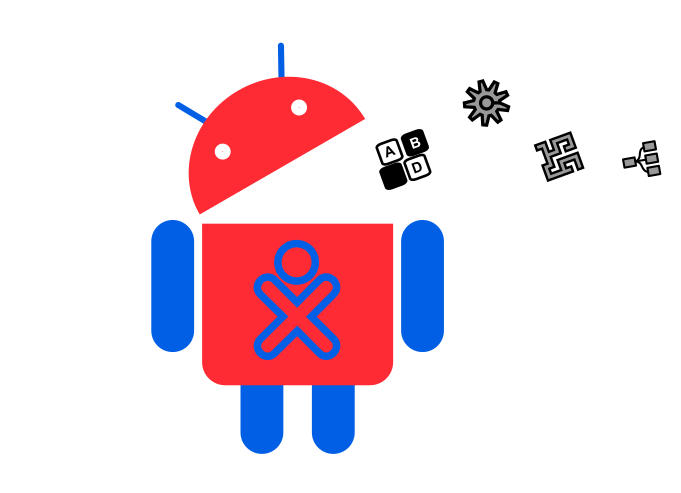

# Sugarizer APK builder

Sugarizer APK builder is a simple way to generate and customize yourself [Sugarizer for Android](https://play.google.com/store/apps/details?id=org.olpc_france.sugarizer). It provides a way to generate an APK without any knowledge on Android developpement.

Note that [Docker](https://www.docker.com) should be installed on your computer to use Sugarizer APK builder.

## Generate your APK
Sugarizer APK builder comes in the form of a runable Docker container. 
Here's the command to launch:

	git clone https://github.com/llaske/sugarizer
	git clone https://github.com/llaske/cordova-plugin-sugarizeros
	sudo docker run --rm -it \
		 -v `pwd`/sugarizer:/sugarizer \
		 -v `pwd`/cordova-plugin-sugarizeros:/cordova-plugin-sugarizeros \
		 -v `pwd`:/output \
		 llaske/sugarizer-apkbuilder:latest
		 
First, you need to clone the [Sugarizer repository](https://github.com/llaske/sugarizer), then the [Cordova plugin for Sugarizer](https://github.com/llaske/cordova-plugin-sugarizeros).

Finally run the docker container [llaske/sugarizer-apkbuilder:latest](https://cloud.docker.com/u/llaske/repository/docker/llaske/sugarizer-apkbuilder) with few arguments:

* `--rm` tell to docker to discard the container at the end of build (optional but recommanded),
* `-it` to run the container interactively (optional),
* `-v ./sugarizer:/sugarizer` is to attach a volume where the container will find Sugarizer,
* `-v ./cordova-plugin-sugarizeros:/cordova-plugin-sugarizeros` is to attach a volume where the container will find the Cordova plugin to build Sugarizer OS,
* `-v .:/output` is to attach a volume where the generated APK will be copied.

At the end of the process (could take **more than 10 minutes**) you will find a `sugarizer.apk` or a `sugarizeros.apk` in the output directory.

Two arguments could be add at the end of the docker command:

* `os` to generate Sugarizer OS - i.e. Sugarizer as a launcher - instead of Sugarizer,
* `full` to avoid the minify JavaScript step. Build will be quicker but JavaScript code will not be optimized,
* `minsize` to reduce size of package by removing local resources in Abecedarium and Scratch,
* `release` to generate an APK without debug information.

## Customize your APK

Customizing your Sugarizer APK could be interesting in many ways. Here's few use cases and how to solve them with Sugarizer APK Builder.

### Change default Sugarizer Server
By default Sugarizer try to contact `http://server.sugarizer.org` when the connection dialog is launched. You could replace this default server URL by your own URL, for example if you need to access to a local server.

To do that, before launching the docker command, update file `sugarizer/js/constant.js` in line 61:

	constant.defaultServer = constant.http + "server.sugarizer.org";
	
Replace string `server.sugarizer.org` by URL of your own server. If your server use HTTPS, replace `constant.http` by `constant.https`.

Finally, launch the usual docker command.

### Change activities on Sugarizer home view
You could customize the set of activities visible by default on the Sugarizer home view. Let's suppose for example that you want to hide the Tank Operation activity.

To do that, before launching the docker command, update file `sugarizer/activities.json` in line 19:

	{"id": "org.olpcfrance.TankOp", "name": "Tank Operation", "version": 1, "directory": "activities/TankOp.activity", "icon": "activity/activity-icon.svg", "favorite": true, "activityId": null},

Replace string `"favorite": true` by `"favorite": false`. You could change visibility of other activities in the same way.

Finally, launch the usual docker command.

### Change activity set
You could customize the set of activities provided with Sugarizer to optimize size of the final APK file or to add your own activities. Let's suppose for example that you want to remove the Abecedarium activity.

To do that, before launching the docker command, first remove the line 15 in file `sugarizer/activities.json`:

	{"id": "org.olpcfrance.Abecedarium", "name": "Abecedarium", "version": 5, "directory": "activities/Abecedarium.activity", "icon": "activity/activity-icon.svg", "favorite": true, "activityId": null},

Then completely remove directory `sugarizer/activities/Abecedarium.activity`.

	rm -rf sugarizer/activities/Abecedarium.activity

Finally, launch the usual docker command.

## Learn more about APK builder
If you want to understand how the APK builder docker container works, you could find docker source [here](src).

# License

Sugarizer APK builder is licensed under the **Apache v2** license. See [LICENSE](LICENSE) for full license text. 

